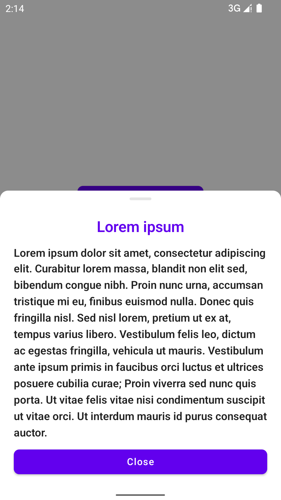
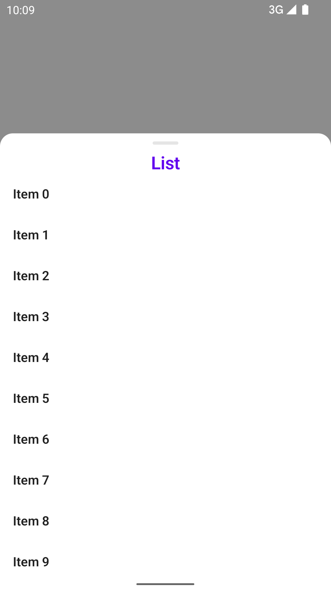
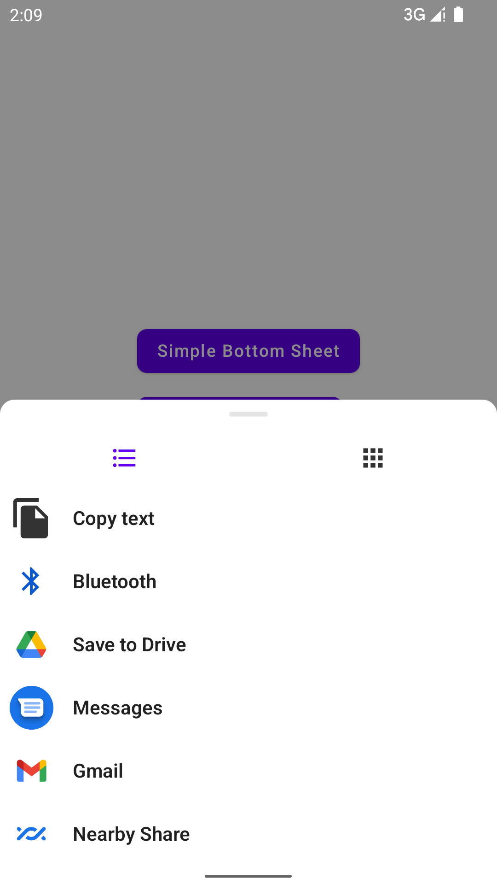

# Sheets

Another BottomSheet in Jetpack Compose.

<a href="images/screenshot_simple.png"></a>
<a href="images/screenshot_list.png"></a>
<a href="images/screenshot_intent-picker.png"></a>

**Features**:


- Independent. Unlike [`ModalBottomSheetLayout`](https://developer.android.com/reference/kotlin/androidx/compose/material/package-summary#ModalBottomSheetLayout(kotlin.Function1,androidx.compose.ui.Modifier,androidx.compose.material.ModalBottomSheetState,androidx.compose.ui.graphics.Shape,androidx.compose.ui.unit.Dp,androidx.compose.ui.graphics.Color,androidx.compose.ui.graphics.Color,androidx.compose.ui.graphics.Color,kotlin.Function0)) , this bottom sheet will be displayed in a dialog window, which means we can easily create and display multiple sheets in the same composable:

  ```kotlin
  @Composable
  fun MyComposable() {
      val scope = rememberCoroutineScope()

      val sheet1 = rememberBottomSheetState()
      val sheet2 = rememberBottomSheetState()

      Column {    
          Button(onClick = { scope.launch { sheet1.expand() } }) {
              Text("Sheet 1")
        }
  
          Button(onClick = { scope.launch { sheet2.expand() } }) {
              Text("Sheet 2")
        }
      }
  
      BottomSheet(state = sheet1) { ... }
      BottomSheet(state = sheet2) { ... }
  }
  ```


- Peek state support:

  ```kotlin
  val state = rememberBottomSheetState()
  
  BottomSheet(
      state = state,
      /*
       * PeekHeight.px(Int) and PeekHeight.fraction(Float) are supported as well.
       */
      peekHeight = PeekHeight.dp(300),
  ) {
      ...
  }
  
  state.peek()
  ```


- Customizable animation spec:

  ```kotlin
  val state = rememberBottomSheetState()
  
  state.expand(animationSpec = spring())
  ```

# Quick start

Add the dependency [](https://maven-badges.herokuapp.com/maven-central/io.github.dokar3/sheets):

```groovy
implementation "io.github.dokar3:sheets:latest_version"
```

**Basic**

```kotlin
val scope = rememberCoroutineScope()
val state = rememberBottomSheetState()

Button(onClick = { scope.launch { state.expand() } }) {
    Text("Show bottom sheet")
}

BottomSheet(state = state) {
    Text("Sheet content")
}
```

**Skip peek state**

To skip peek state, set `peekHeight` to a value at least equal to the content height, eg. `PeekHeight.px(Int.MAX_VALUE)`, `PeekHeight.fraction(1f)`:

```kotlin
BottomSheet(
    state = state,
    peekHeight = PeekHeight.fraction(1f),
) { 
    ...
}
```

**Embedded sheet**

To embed the sheet in the current layout hierarchy, use the `BottomSheetLayout()`:

```kotlin
Box {
    OtherContent()
    
    val state = rememberBottomSheetState()
    if (state.visible) {
        BottomSheetLayout(state = state) {
            ...
        }
    }
}
```

# License

```
Copyright 2022 dokar3

Licensed under the Apache License, Version 2.0 (the "License");
you may not use this file except in compliance with the License.
You may obtain a copy of the License at

    http://www.apache.org/licenses/LICENSE-2.0

Unless required by applicable law or agreed to in writing, software
distributed under the License is distributed on an "AS IS" BASIS,
WITHOUT WARRANTIES OR CONDITIONS OF ANY KIND, either express or implied.
See the License for the specific language governing permissions and
limitations under the License.
```
